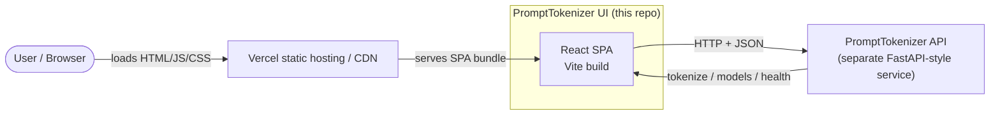
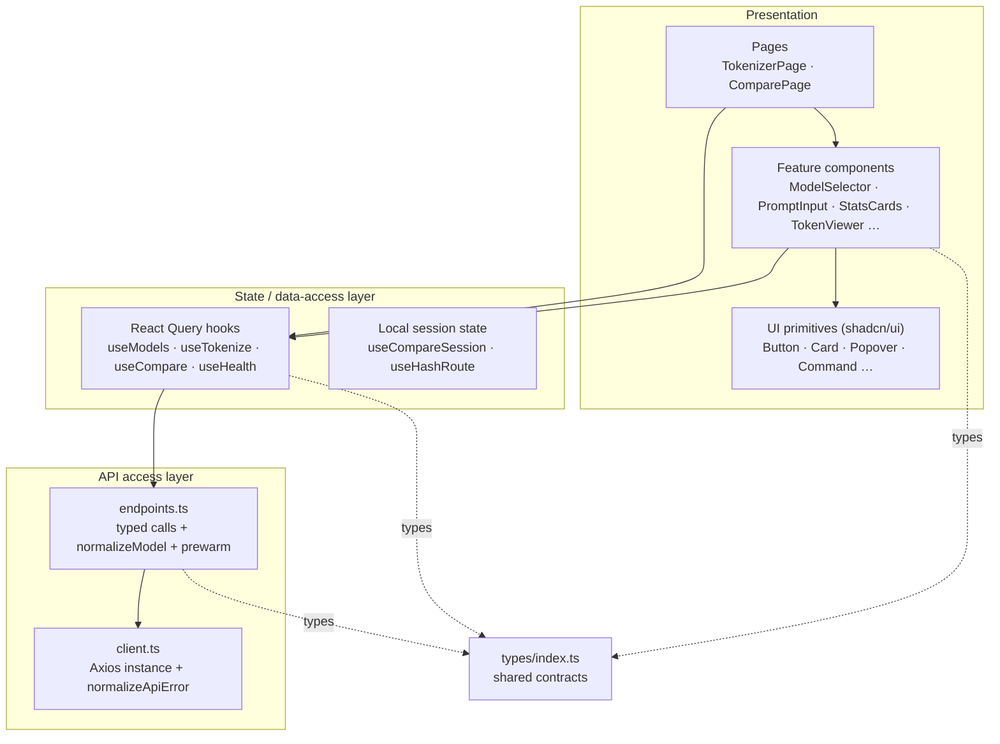
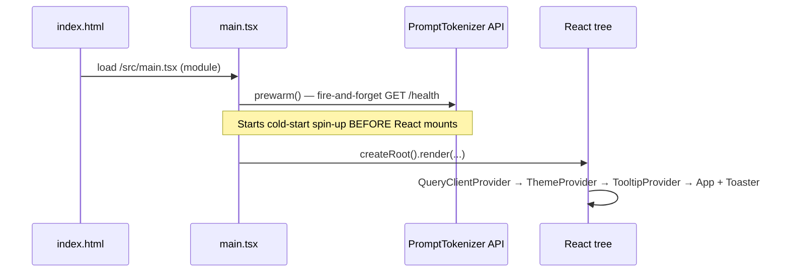
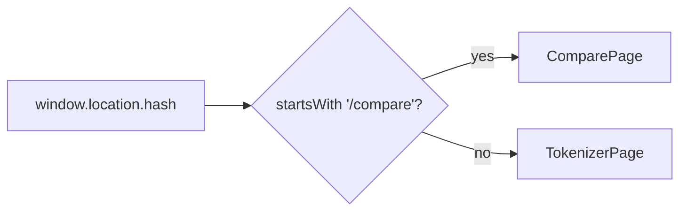
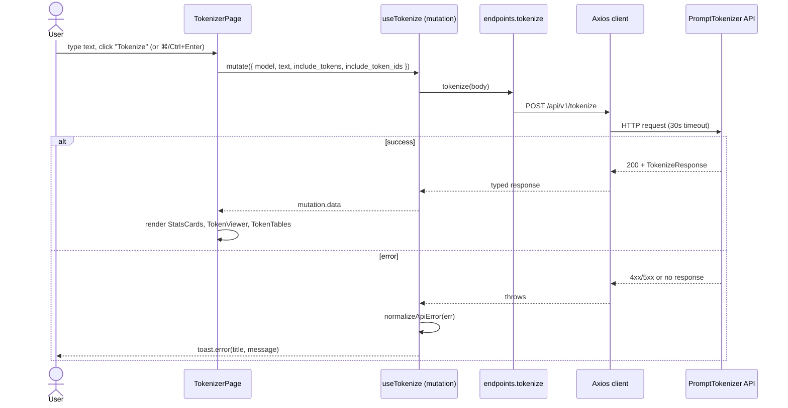

# 02 — High-Level Architecture

## System context

PromptTokenizer UI is a static single-page application that depends on one
external service: the **PromptTokenizer API**. There is no other backend,
database, queue, or third-party data store.



- The **bundle** (HTML/JS/CSS + static assets) is served from Vercel's CDN.
- All dynamic data (models, tokenization, health) is fetched at runtime from the
  API. The base URL is resolved from `VITE_API_BASE_URL`; when empty the dev
  proxy forwards `/api` and `/health` to `http://localhost:8000`
  (`src/api/client.ts:10`, `vite.config.ts:14`).

## Layered architecture (inside the SPA)

The frontend is organized into clear layers, each depending only on the layer
below it.



| Layer | Responsibility | Key files |
| ----- | -------------- | --------- |
| **Pages** | Compose a full screen; own page-level state | `src/pages/*` |
| **Feature components** | Self-contained UI features | `src/components/<Feature>/*` |
| **UI primitives** | Reusable, style-only building blocks | `src/components/ui/*` |
| **Hooks** | Bridge React ↔ server state; cache, retry, toasts | `src/hooks/*` |
| **API access** | HTTP calls, response normalization, error mapping | `src/api/*` |
| **Types** | Single source of truth for data shapes | `src/types/index.ts` |
| **Lib** | Pure helpers (formatting, clipboard, colors) | `src/lib/*` |

## Application bootstrap

`src/main.tsx` is the composition root. The order of operations matters:



Provider nesting (`src/main.tsx:24`):

```
<React.StrictMode>
  <QueryClientProvider>      // TanStack Query cache
    <ThemeProvider>          // next-themes (class strategy, default dark)
      <TooltipProvider>      // Radix tooltip context, 200ms delay
        <App />
        <Toaster />          // sonner toast portal
```

The global `QueryClient` is configured once: `refetchOnWindowFocus: false` and
`retry: 1` as defaults (`src/main.tsx:15`). Individual hooks override these as
needed (e.g. `useHealth` re-enables focus refetch).

## Routing

There is **no router library**. `src/App.tsx` reads the location hash via
`useHashRoute` and renders one of two pages:



- `#/` (or empty) → **TokenizerPage**
- `#/compare` → **ComparePage**

`useHashRoute` (`src/hooks/useHashRoute.ts`) uses `useSyncExternalStore` to
subscribe to the browser `hashchange` event. Because `<App>` stays mounted
across hash changes, the Compare page's working state is **hoisted into `<App>`**
via `useCompareSession` so it survives navigating away and back
(`src/App.tsx:10`). See [State & Data Flow](./08-state-and-data-flow.md).

## End-to-end data flow: tokenizing text



The Compare flow is analogous but uses `useCompare` → `POST /api/v1/compare`,
and renders `CompareResults`. Crucially, **per-model failures in Compare are not
errors** — they come back inside the `results[]` array with an `error` field, so
the table shows successful models alongside failed ones
(`src/hooks/useCompare.ts:11`).

## Architectural decisions (and why)

| Decision | Rationale |
| -------- | --------- |
| **Frontend-only, thin client** | Tokenization correctness must come from real encoders; duplicating that in the browser would drift and bloat the bundle. |
| **Hash routing, no router lib** | Two routes don't justify `react-router`; hash routes also need zero server rewrite config beyond Vercel's catch-all (`src/hooks/useHashRoute.ts:5`). |
| **React Query for all server state** | Free caching, retries, loading/error states, and background refetch (used to keep the backend warm). |
| **Defensive, mostly-optional types** | The UI tolerates payload drift and partial responses rather than crashing (`src/types/index.ts:5`). |
| **Single shared hover tooltip** | One floating element instead of a Radix tooltip per token keeps thousands of token blocks renderable without jank (`HoverTooltip.tsx:17`). |
| **Compare state hoisted to `<App>`** | Pages unmount on route change; hoisting preserves user input across navigation (`src/App.tsx:8`). |
| **Pre-warm before React mounts** | Overlaps the Render free-tier cold start with app init to cut perceived latency (`src/main.tsx:13`). |

See [State & Data Flow](./08-state-and-data-flow.md) and
[Performance](./16-performance.md) for the consequences of these choices.
