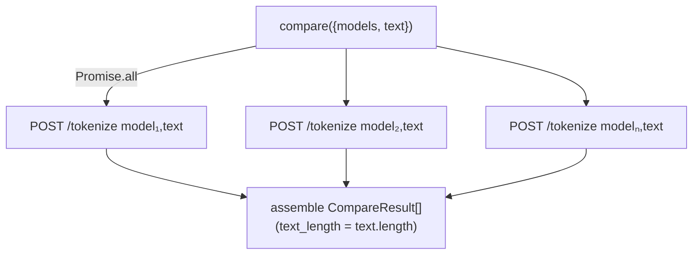

# 06 — API Integration, Endpoints & Contracts

The UI is a thin client over the **PromptTokenizer API**. This section documents
every endpoint the UI calls, the request/response contracts, and the client/
access layer that wraps them.

> The API's internal implementation is out of scope — what's documented here is
> the **contract the UI depends on**, derived from `src/api/*` and
> `src/types/index.ts`.

## Base URL & client configuration

`src/api/client.ts`:

```ts
export const API_BASE_URL = import.meta.env.VITE_API_BASE_URL ?? "";
export const API_PREFIX = "/api/v1";

export const apiClient = axios.create({
  baseURL: API_BASE_URL,
  timeout: 30_000,                       // 30s
  headers: { "Content-Type": "application/json" },
});
```

- When `VITE_API_BASE_URL` is **empty**, requests are relative (`/api/...`,
  `/health`) and go through the **Vite dev proxy** to `http://localhost:8000`
  (`vite.config.ts:14`).
- When set, requests hit that absolute origin directly (production /
  cross-origin). See [Configuration](./09-configuration.md).
- All requests share a **30-second timeout**.

## Endpoint catalog

There are **only four real backend endpoints**. The two "compare" features are
*not* backed by dedicated endpoints — they are composed client-side by fanning
out parallel `/api/v1/tokenize` calls (see
[Compare — client-side composition](#compare--client-side-composition)).

| Method | Backend path | Wrapper (`endpoints.ts`) | Hook | Used by |
| ------ | ------------ | ------------------------ | ---- | ------- |
| GET | `/health` | `getHealth()` / `prewarm()` | `useHealth` | HealthWidget, keep-warm |
| GET | `/api/v1/models` | `getModels()` | `useModels` | both model selectors |
| GET | `/api/v1/models/{id}` | `getModel(id)` | _(none yet)_ | available helper |
| POST | `/api/v1/tokenize` | `tokenize(body)` | `useTokenize` | TokenizerPage; **also the building block for both compares** |
| _(client-side)_ | N× `POST /api/v1/tokenize` | `compare(body)` | `useCompare` | ComparePage — "Across models" mode |
| _(client-side)_ | N× `POST /api/v1/tokenize` | `comparePrompts(body)` | `useComparePrompts` | ComparePage — "Across prompts" mode |

> **Changed in `7e0b235`:** the client no longer calls a `POST /api/v1/compare`
> endpoint. `compare()` was rewritten to fan out `/tokenize` calls so it can also
> collect each model's `estimated_input_cost` (which `/compare` did not return).
> See the [issues log](./issues-and-recommendations.md) for the fan-out
> concurrency note.

---

### `GET /health`

Returns service status and memory usage. Consumed by the health widget and used
as the keep-warm ping.

**Response — `HealthResponse`:**

```jsonc
{
  "status": "ok",              // also accepts: healthy | up | pass
  "service": "prompt-tokenizer",
  "version": "1.2.3",
  "memory": {
    "rss_mb": 225.1,
    "vms_mb": 512.0
  }
  // additional fields tolerated (index signature)
}
```

- `isHealthy()` treats `ok | healthy | up | pass` (case-insensitive) as healthy
  (`useHealth.ts:30`).
- `readMemory()` extracts `memory.rss_mb` / `memory.vms_mb` (megabytes).

**`prewarm()`** (`endpoints.ts:25`) is a fire-and-forget `fetch` (not Axios) to
`${API_BASE_URL}/health` with `keepalive: true`, called from `main.tsx` *before*
React mounts. All errors are swallowed — its only job is to start a sleeping
free-tier backend spinning up sooner.

---

### `GET /api/v1/models`

Returns the model catalog. The UI **never hardcodes models**.

**Response — `ModelsResponse`:** `{ "items": RawModel[] }`. The client also
tolerates a bare array (`endpoints.ts:63`).

**`RawModel` (raw API shape):**

```jsonc
{
  "id": "gpt-4o",
  "label": "GPT-4o",
  "group": "OpenAI · GPT-4",
  "provider": "openai",
  "adapter": "tiktoken",
  "tokenizer_ref": "o200k_base",
  "status": "stable",            // or "deprecated" / "legacy"
  "description": "Multimodal flagship",
  "context_window": 128000,
  "notes": null,
  "supports_token_decode": true,
  "supports_browser": true,
  "deprecated": false
}
```

**Normalization — `normalizeModel(raw)`** (`endpoints.ts:42`) maps the raw shape
to the UI's `Model`:

| `Model` field | Source | Fallback |
| ------------- | ------ | -------- |
| `id` | `raw.id` | — |
| `name` | `raw.label` (trimmed) | `raw.id` |
| `family` | `raw.group` (trimmed) | `"Other"` |
| `description` | `raw.description` | — |
| `encoding` | `raw.tokenizer_ref` | — |
| `provider` | `raw.provider` | — |
| `context_window` | `raw.context_window` | — |
| `deprecated` | `raw.deprecated === true` **or** `status` is `deprecated`/`legacy` | `false` |
| `status` | `raw.status` | — |

Grouping for the dropdown is done by `groupModelsByFamily()` (`useModels.ts:25`),
which **preserves the order in which each family first appears** so the backend
controls ordering.

---

### `GET /api/v1/models/{id}`

`getModel(id)` fetches a single model and normalizes it. Currently provided as a
helper; no hook consumes it yet.

---

### `POST /api/v1/tokenize`

Tokenize one text with one model.

**Request — `TokenizeRequest`:**

```jsonc
{
  "model": "gpt-5",
  "text": "Hello world",
  "include_tokens": true,        // UI always sends true
  "include_token_ids": true      // UI always sends true
}
```

**Response — `TokenizeResponse`:**

```jsonc
{
  "model": "gpt-5",
  "resolved_tokenizer": "o200k_base",  // tokenizer the backend resolved this model to (added 7e0b235)
  "token_count": 2,
  "word_count": 2,
  "character_count": 11,
  "estimated_input_cost": 0.0000004,  // may be null → "Pricing unavailable"
  "cost_currency": "USD",
  "tokens": ["Hello", " world"],      // present when include_tokens
  "token_ids": [13225, 1879],         // present when include_token_ids
  "context_window": 400000            // some backends echo this
}
```

Notes:
- `tokens` and `token_ids` are positionally aligned — index `i` of one
  corresponds to index `i` of the other; the viewers and tables rely on this.
- `estimated_input_cost` being `null` is a normal, expected state.
- `resolved_tokenizer` (added in `7e0b235`) is what the compare features read to
  show each model/prompt's actual tokenizer.

---

## Compare — client-side composition

Both comparison features are built **on top of `/tokenize`**, not on dedicated
endpoints. Each fans out one `/tokenize` call per item via `Promise.all` and
assembles the per-item results, capturing failures inline. This is what lets the
UI rank by **estimated cost** as well as token count — `/tokenize` returns
`estimated_input_cost`, which the abandoned `/compare` endpoint did not.



### `compare(body)` — one text, several models (`endpoints.ts`)

**Input — `CompareRequest`:** `{ models: string[], text: string }`.

For each model it calls `tokenize({ model, text })` and maps the response into a
`CompareResult`:

```jsonc
{
  "text_length": 11,                  // = body.text.length (computed client-side)
  "results": [
    { "model": "gpt-5",      "resolved_tokenizer": "o200k_base", "token_count": 2,    "estimated_input_cost": 0.0000004, "cost_currency": "USD", "error": null },
    { "model": "gpt-5-mini", "resolved_tokenizer": "o200k_base", "token_count": 2,    "estimated_input_cost": 0.0000002, "cost_currency": "USD", "error": null },
    { "model": "bad-model",  "resolved_tokenizer": null,         "token_count": null, "estimated_input_cost": null,       "cost_currency": null,  "error": "Model not supported" }
  ]
}
```

- A failed model's `error` is set to `normalizeApiError(error).message` (the
  friendly message), and its `token_count`/cost fields are `null`.
- `cost_currency` defaults to `null` when the backend omits it.

### `comparePrompts(body)` — one model, several prompts (`endpoints.ts`)

The mirror image: the **model is fixed and the prompts vary**.

**Input — `ComparePromptsRequest`:** `{ model: string, prompts: string[] }`
(typically two prompts).

```jsonc
{
  "model": "gpt-5",
  "resolved_tokenizer": "o200k_base",  // first non-null tokenizer seen across prompts
  "results": [
    { "index": 0, "text_length": 99, "word_count": 17, "token_count": 19, "estimated_input_cost": 0.0000019, "cost_currency": "USD", "error": null },
    { "index": 1, "text_length": 38, "word_count": 6,  "token_count": 7,  "estimated_input_cost": 0.0000007, "cost_currency": "USD", "error": null }
  ]
}
```

- Each `PromptCompareResult` carries its 0-based `index`, `text_length`
  (computed client-side as `text.length`), `word_count`, `token_count`, cost,
  and an inline `error`.
- `resolved_tokenizer` is the first non-null tokenizer seen (all prompts resolve
  to the same tokenizer for a given model).

### Partial-failure & error semantics (both)

A per-item failure is captured **inline** (`token_count: null` + a populated
`error`); the overall promise still resolves successfully. The `useCompare` /
`useComparePrompts` hooks' `onError` only fires on a **request-level** failure
(network, validation, etc.) — not on per-item errors
(`useCompare.ts:11`, `useComparePrompts.ts`).

> Because the fan-out uses `Promise.all`, **all** per-item `/tokenize` requests
> fire concurrently (up to 10 for model comparison). See the
> [issues log](./issues-and-recommendations.md) for the unbounded-concurrency
> note.

---

## Error contract

The API is expected to return errors in this envelope (`ApiErrorBody`):

```jsonc
{ "error": { "code": "MODEL_NOT_SUPPORTED", "message": "…", "details": {} } }
```

`normalizeApiError()` (`client.ts:73`) maps these to a `NormalizedApiError`
`{ code, status, title, message }`. The mapping:

| HTTP status | Inferred code | User-facing title |
| ----------- | ------------- | ----------------- |
| 404 | `MODEL_NOT_SUPPORTED` | "Model not supported" |
| 422 | `VALIDATION_ERROR` | "Invalid request" |
| 503 | `TOKENIZER_NOT_AVAILABLE` | "Tokenizer unavailable" |
| 500 | `INTERNAL_ERROR` | "Something went wrong" |
| _no response_ | `NETWORK_ERROR` | "Can't reach the server" |
| anything else | `UNKNOWN` | "Unexpected error" |

Resolution order: a **backend-provided `error.code`** wins if it's a known code;
otherwise the code is inferred from HTTP status. The backend's
`error.message` is shown if present, else canned copy. See
[Error Handling](./12-error-handling-logging.md) for the full flow.

---

## Authentication & authorization

**There is none.** The API is treated as a public, unauthenticated tokenization
service. No tokens, cookies, API keys, or `Authorization` headers are sent by
the client (`apiClient` sets only `Content-Type`). There are no roles,
permissions, or protected routes in the UI. See [Security](./13-security.md) for
the implications.

## Database & persistence

The UI has **no database** and performs **no persistence** beyond the
`next-themes` theme preference (stored by that library, typically in
`localStorage`). All "models", "pricing", and "context window" data is fetched
live from the API per session and cached only in-memory by React Query. The
closest thing to a schema is the TypeScript type system — see
[Data Models & Types](./07-data-models.md).
