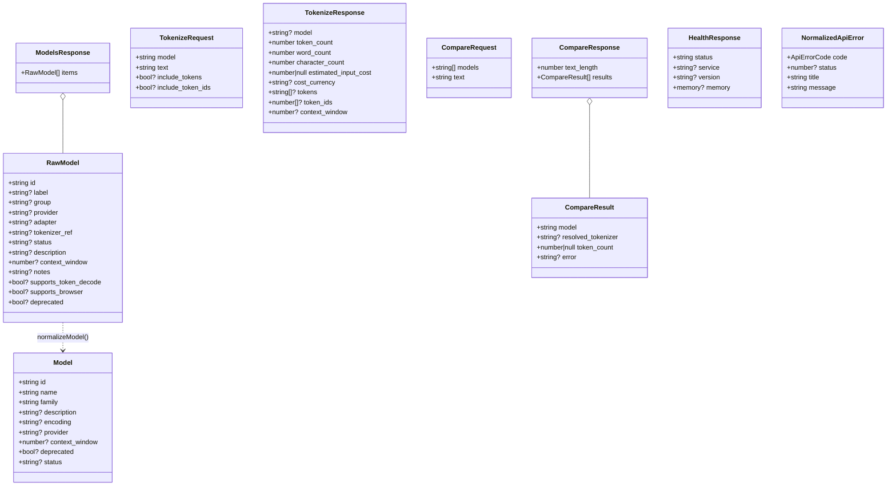

# 07 — Data Models & Types

This project has no database, so its "schema" is the TypeScript type system in
`src/types/index.ts`. These types are the single source of truth for every data
shape that crosses the API boundary. A guiding principle (stated at the top of
the file) is that fields are kept **optional and defensive** so the UI never
crashes on a slightly different payload.



## Models

### `RawModel`
The entry exactly as returned by `GET /api/v1/models`. Only `id` is required;
everything else is optional/nullable. Note the backend uses `label`/`group`/
`tokenizer_ref` rather than the UI's `name`/`family`/`encoding`.

### `Model` (normalized)
The shape used everywhere in the UI, produced by `normalizeModel()`. See the
mapping table in [API Integration](./06-api-integration.md#get-apiv1models).
Key derived field: `deprecated` is `true` if `raw.deprecated === true` **or**
`status` is `"deprecated"`/`"legacy"`.

### `ModelGroup` (`src/hooks/useModels.ts`)
```ts
interface ModelGroup { family: string; models: Model[]; }
```
A view model produced by `groupModelsByFamily()` for the grouped dropdown.

## Tokenize

### `TokenizeRequest` / `TokenizeResponse`
See [API Integration](./06-api-integration.md#post-apiv1tokenize). Important
invariant: when present, `tokens[i]` and `token_ids[i]` describe the **same
token** — all token-viewer and table logic depends on this positional
alignment.

## Compare

### `CompareRequest` / `CompareResult` / `CompareResponse`
See [API Integration](./06-api-integration.md#post-apiv1compare). `CompareResult`
encodes **per-model success or failure**: a number `token_count` + null `error`
means success; null `token_count` + a string `error` means that one model
failed while others may have succeeded.

### `Row` (`src/components/CompareResults/CompareResults.tsx`)
A view model derived from `CompareResult[]` adding `rank`, `deltaPct`, `isBest`,
and a resolved display `name`. Not part of the API contract.

## Health

### `HealthResponse`
`status` is the only field the UI strictly relies on (via `isHealthy`). `memory`
is an optional object of megabyte values. An index signature (`[key: string]:
unknown`) lets the API add fields without breaking the type.

## Errors

### `ApiErrorCode`
A union: `MODEL_NOT_SUPPORTED | VALIDATION_ERROR | TOKENIZER_NOT_AVAILABLE |
INTERNAL_ERROR | NETWORK_ERROR | UNKNOWN`.

### `ApiErrorBody`
The expected error envelope from the API: `{ error?: { code?, message?, details? } }`.

### `NormalizedApiError`
The UI-facing error: `{ code, status?, title, message }`. This is what hooks
throw and what toasts render. See
[Error Handling](./12-error-handling-logging.md).

## View-model types (UI-only)

These live in component/hook files, not `types/index.ts`, because they never
cross the API boundary:

| Type | File | Role |
| ---- | ---- | ---- |
| `ModelGroup` | `useModels.ts` | Grouped dropdown data |
| `CompareSession` | `useCompareSession.ts` | Hoisted Compare state bundle |
| `Row` | `CompareResults.tsx` | Ranked comparison rows |
| `WordSegment`, `ExpensiveWord`, `FrequentToken` | `TokenTables.tsx` | Analytics rows |
| `TokenInfo`, `TooltipState` | `HoverTooltip.tsx` | Tooltip payload |
| `TokenColor` | `token-colors.ts` | Palette entry |
