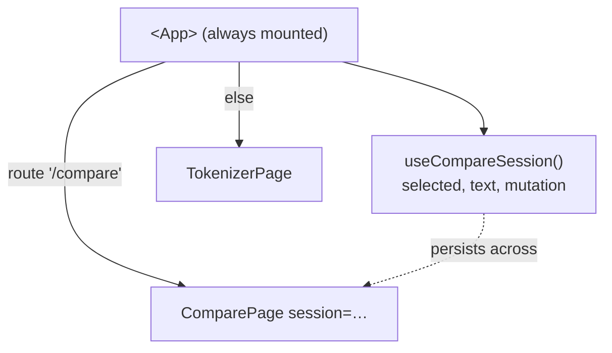
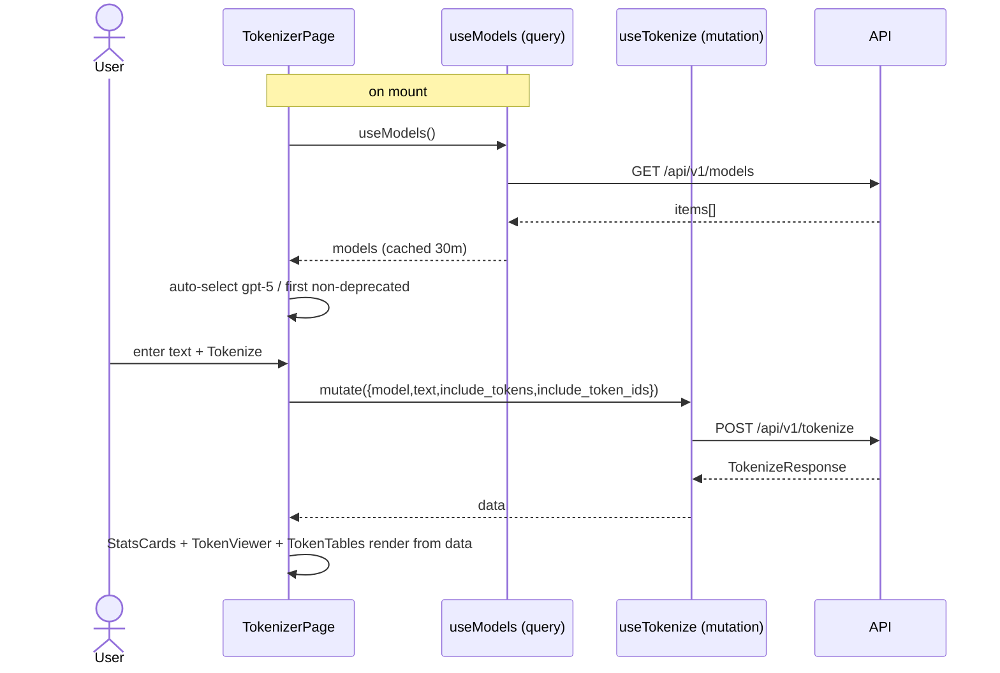
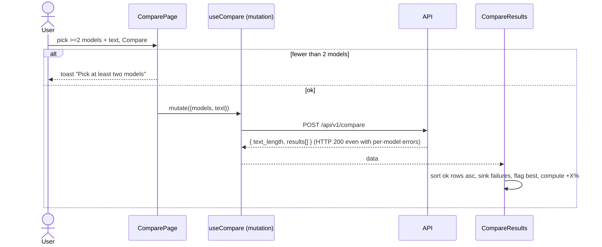

# 08 — State Management & Data Flow

The app has two kinds of state:

1. **Server state** — data owned by the API (models, tokenization results,
   health). Managed entirely by **TanStack React Query**.
2. **Local/UI state** — selections, input text, open/closed toggles, the current
   route. Managed by `useState` / custom hooks.

There is no Redux, Zustand, or Context-based global store beyond the providers in
`main.tsx`.

## The React Query layer

A single `QueryClient` is created in `main.tsx` with these defaults:

```ts
defaultOptions: { queries: { refetchOnWindowFocus: false, retry: 1 } }
```

### Hooks overview

| Hook | Type | Key | Caching / behavior |
| ---- | ---- | --- | ------------------ |
| `useModels` | query | `["models"]` | `staleTime: 30min`, `retry: 1` — catalog rarely changes |
| `useHealth` | query | `["health"]` | `refetchInterval: 10min`, `refetchIntervalInBackground: true`, `refetchOnWindowFocus: true`, `staleTime: 10s` |
| `useTokenize` | mutation | — | normalizes errors → toast on failure |
| `useCompare` | mutation | — | normalizes errors → toast on **request-level** failure only |

### `useModels` & grouping (`src/hooks/useModels.ts`)

- `useModels()` fetches the catalog once and caches it aggressively (30-minute
  stale time) — both model selectors share this single cache entry.
- `groupModelsByFamily(models)` is a pure function that buckets models by
  `family`, preserving first-appearance order.
- `useGroupedModels()` is a convenience hook returning `{ ...query, groups }`.

### `useHealth` (`src/hooks/useHealth.ts`)

This hook does double duty:
- It feeds the `HealthWidget`.
- Its **10-minute background refetch keeps the free-tier backend warm** so it
  doesn't idle to sleep. `refetchIntervalInBackground: true` keeps pinging even
  when the tab is unfocused.

Helpers: `isHealthy(data)` and `readMemory(data)`.

> Historical note: the README mentions a 30-second poll; the current
> implementation polls every **10 minutes** (`useHealth.ts:14`). The code is
> authoritative.

### Mutations (`useTokenize`, `useCompare`)

Both follow the same pattern (`src/hooks/useTokenize.ts`):

```ts
return useMutation({
  mutationFn: async (body) => {
    try { return await tokenize(body); }
    catch (error) { throw normalizeApiError(error); }
  },
  onError: (error) => toast.error(error.title, { description: error.message }),
});
```

So the mutation's `error` is always a `NormalizedApiError`, and failures
automatically surface as a toast.

## Local state map

| State | Owner | Notes |
| ----- | ----- | ----- |
| Selected model (Tokenize) | `TokenizerPage` `useState` | auto-selected on load |
| Input text (Tokenize) | `TokenizerPage` `useState` | |
| Selected models + text (Compare) | `useCompareSession` in `<App>` | **hoisted** so it survives navigation |
| Token viewer mode (tokens/ids) | `TokenViewer` `useState` | with effective-mode fallback |
| "Show all" caps | `TokenBlocks` / `TokenIdChips` `useState` | reveal beyond 5000 |
| JSON panel open | `JsonViewer` `useState` | |
| Popover open | selectors / widget | |
| Current route | `useHashRoute` | external store via `useSyncExternalStore` |
| Theme | `next-themes` | persisted by the library |

### Why Compare state is hoisted

`<App>` stays mounted across hash-route changes, but the page components unmount
when you navigate away. If Compare state lived inside `ComparePage`, switching to
Tokenize and back would lose the user's selected models and text. So
`useCompareSession()` is instantiated in `<App>` and passed down as a `session`
prop (`App.tsx:10`, `useCompareSession.ts`).



## Routing data flow

`useHashRoute` (`src/hooks/useHashRoute.ts`) reads `window.location.hash` and
subscribes to `hashchange` via `useSyncExternalStore`:

```ts
useSyncExternalStore(subscribe, getHash, () => "/");
```

- `getHash()` strips the leading `#` and defaults to `/`.
- The third arg (server snapshot) returns `"/"` purely to satisfy
  `useSyncExternalStore` under React 18 strict mode — there is no SSR.
- Navigation is plain `<a href="#/compare">` links in the `Header`.

## Tokenize sequence (detailed)



## Compare sequence (with partial failure)



## Data-flow principles

- **Components never call Axios.** They depend on a hook.
- **Hooks never render.** They return data/flags; rendering is the component's
  job.
- **Server state is cached; UI state is ephemeral.** Refreshing the page resets
  all UI state (no persistence) but the model/health caches re-warm quickly.
- **Errors travel as data.** Mutations throw a `NormalizedApiError`; per-model
  compare errors travel inside `results[]`.
