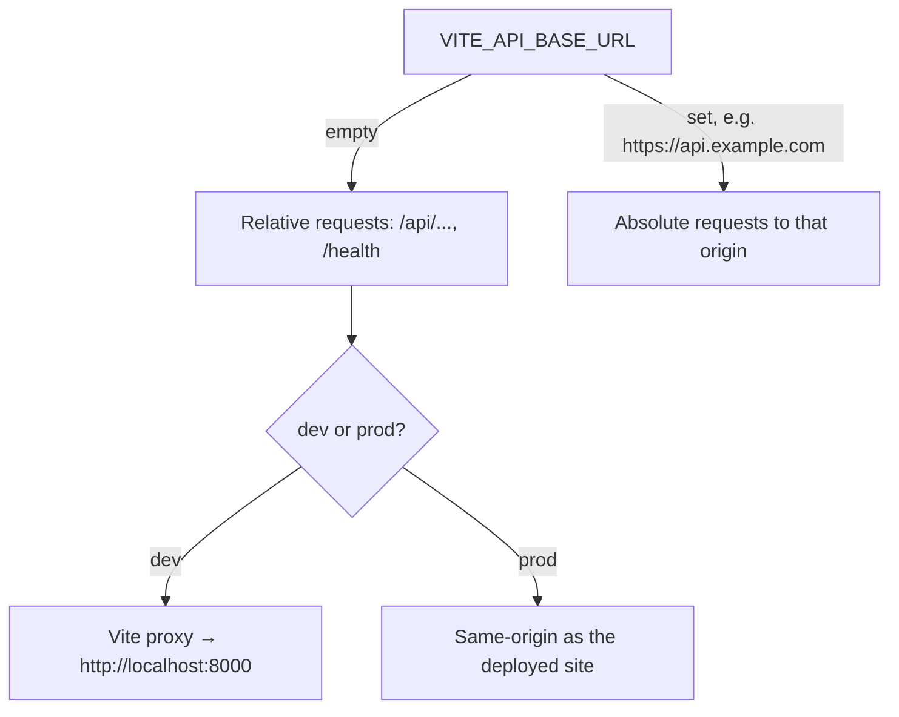

# 09 — Configuration & Environment Variables

All configuration is build-time (Vite) — there is no runtime config server.
Environment variables are read through `import.meta.env` and **must be prefixed
with `VITE_`** to be exposed to client code.

## Environment variables

| Variable | Type | Default | Where used | Purpose |
| -------- | ---- | ------- | ---------- | ------- |
| `VITE_API_BASE_URL` | string | `""` (empty) | `src/api/client.ts:10`, `endpoints.ts` (`prewarm`) | Base origin of the PromptTokenizer API. Empty → use the dev proxy. |
| `VITE_UI_PORT` | string | _(unused)_ | declared in `.env` only | Intended dev/preview port. **Not currently wired into `vite.config.ts`** (which hardcodes `port: 5173`). See note below. |

Typed in `src/vite-env.d.ts`:

```ts
interface ImportMetaEnv { readonly VITE_API_BASE_URL?: string; }
```

### `VITE_API_BASE_URL` behavior



- **Dev, empty:** `/api` and `/health` are proxied to `http://localhost:8000`
  (`vite.config.ts:14`) — no CORS setup needed.
- **Prod / direct:** set it to the API origin, e.g.
  `VITE_API_BASE_URL=https://prompttokenizer.onrender.com`. The API must then
  allow CORS from the site origin.

## `.env` files

- **`.env.example`** (committed) — template documenting `VITE_API_BASE_URL`.
- **`.env`** (git-ignored) — local overrides. The current local `.env` sets:
  ```bash
  VITE_API_BASE_URL=http://localhost:8192
  VITE_UI_PORT=4096
  ```
- `.gitignore` ignores `.env` and `.env.*` but **keeps** `.env.example`
  (`!.env.example`).

To get started:

```bash
cp .env.example .env
# edit VITE_API_BASE_URL as needed (leave empty to use the dev proxy)
```

> **Discrepancy to be aware of:** `.env` declares `VITE_UI_PORT=4096`, but
> `vite.config.ts` hardcodes `server.port: 5173` and never reads `VITE_UI_PORT`.
> The dev server therefore runs on **5173** regardless. If you want
> `VITE_UI_PORT` to take effect, wire it into `vite.config.ts` (e.g. read
> `process.env.VITE_UI_PORT` via `loadEnv`) — see
> [Troubleshooting](./17-troubleshooting.md).

## Vite configuration — `vite.config.ts`

```ts
export default defineConfig({
  plugins: [react()],
  resolve: { alias: { "@": path.resolve(__dirname, "./src") } },
  server: {
    port: 5173,
    proxy: {
      "/api":    { target: "http://localhost:8000", changeOrigin: true },
      "/health": { target: "http://localhost:8000", changeOrigin: true },
    },
  },
});
```

- **`@` alias** → `src/` (must stay in sync with the `tsconfig` paths).
- **Dev proxy** forwards `/api` and `/health` to the local API on port 8000.
  This proxy only runs under `vite dev`; it has no effect on the production
  build.

## TypeScript configuration

| File | Scope | Notable options |
| ---- | ----- | --------------- |
| `tsconfig.json` | solution / references | declares `@/*` path; references the two below |
| `tsconfig.app.json` | `src/**` | `strict`, `noUnusedLocals`, `noUnusedParameters`, `noFallthroughCasesInSwitch`, `noEmit`, `jsx: react-jsx`, `moduleResolution: bundler` |
| `tsconfig.node.json` | `vite.config.ts` | node-targeted config |

`tsc -b` runs first in the build script, so a type error fails the build.

## Tailwind / PostCSS

- `tailwind.config.js` — dark mode via `class`, content globs
  (`./index.html`, `./src/**/*.{ts,tsx}`), the full color token map (mapped to
  CSS variables), custom keyframes/animations, and the `tailwindcss-animate`
  plugin.
- `postcss.config.js` — runs `tailwindcss` then `autoprefixer`.
- Design tokens (the actual color values) are defined as CSS variables in
  `src/index.css` for both `:root` (light) and `.dark`. See
  [Styling & Theming](./11-styling-theming.md).

## Vercel configuration — `vercel.json`

```json
{
  "buildCommand": "npm run build",
  "outputDirectory": "dist",
  "rewrites": [{ "source": "/(.*)", "destination": "/index.html" }]
}
```

The catch-all rewrite serves `index.html` for every path, which is what lets the
SPA (and its hash routes) work without server-side route config. See
[Build & Deploy](./10-build-deploy.md).

## Static / SEO configuration

| File | Configures |
| ---- | ---------- |
| `index.html` | `<title>`, meta description/keywords, canonical URL, Open Graph + Twitter cards, favicons, JSON-LD `WebApplication` schema, `robots` meta |
| `public/robots.txt` | crawler allow-all + sitemap pointer |
| `public/site.webmanifest` | PWA name, icons, theme/background color |

> The canonical/OG URLs point at `https://prompt-tokenizer.site/`. Update these
> if the production domain changes.
