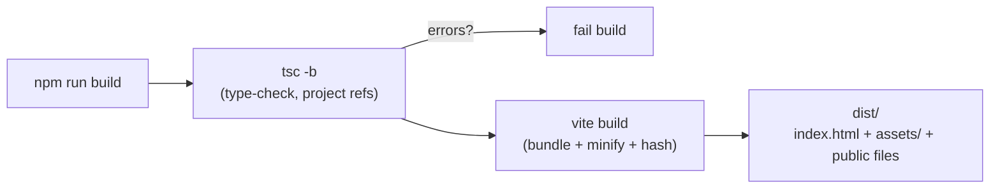
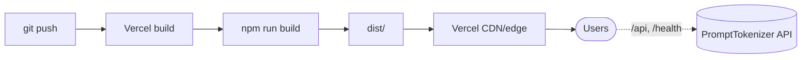

# 10 — Build, Deployment & CI/CD

## npm scripts (`package.json`)

| Command | What it does |
| ------- | ------------ |
| `npm run dev` | Start the Vite dev server (port 5173) with HMR and the `/api`+`/health` proxy |
| `npm run build` | `tsc -b && vite build` — type-check the whole project, then produce the static bundle in `dist/` |
| `npm run preview` | Serve the built `dist/` locally to verify the production bundle |
| `npm run lint` | `eslint .` (see the ESLint caveat in [Tech Stack](./03-tech-stack.md)) |

## Build pipeline



1. **`tsc -b`** type-checks using the project references. It emits nothing
   (`noEmit`) but **fails the build on any type error** — types are a real gate,
   not advisory.
2. **`vite build`** transpiles, tree-shakes, minifies, and content-hashes assets
   into `dist/`. Everything in `public/` is copied verbatim to the output root.

The resulting `dist/` (≈650 KB including images) contains:

```text
dist/
├── index.html
├── assets/            # hashed JS + CSS bundles
├── favicon.svg, favicon-16x16.png, favicon-32x32.png, apple-touch-icon.png
├── banner.png, og-image.png
├── robots.txt
└── site.webmanifest
```

## Deployment (Vercel)

The project is configured for **Vercel static hosting** via `vercel.json`:

```json
{
  "buildCommand": "npm run build",
  "outputDirectory": "dist",
  "rewrites": [{ "source": "/(.*)", "destination": "/index.html" }]
}
```

- **Build:** Vercel runs `npm run build` and serves `dist/`.
- **SPA rewrite:** the catch-all rewrite returns `index.html` for any path, so
  deep links and hash routes (`#/compare`) resolve to the SPA. Hash routing
  means the rewrite is the *only* server-side routing config needed.
- **Environment:** set `VITE_API_BASE_URL` in the Vercel project's environment
  variables to point the deployed UI at the production API. Because it's a
  build-time variable, **changing it requires a redeploy**.



The UI and API are deployed **independently**. The UI is a static bundle on
Vercel; the API is a separate service (the code/comments reference a **Render**
free-tier deployment, e.g. `https://prompttokenizer.onrender.com`).

## Backend cold-start handling

The API runs on a free tier that **sleeps when idle**, causing a multi-second
cold start. The UI mitigates this in two ways:

1. **Pre-warm on load** — `prewarm()` fires a `fetch('/health')` from
   `main.tsx` *before React mounts*, so the spin-up overlaps app init
   (`main.tsx:13`, `endpoints.ts:25`).
2. **Keep-warm polling** — `useHealth` re-pings `/health` every 10 minutes,
   including in the background, to keep the dyno awake while the tab is open
   (`useHealth.ts:14`).

See [Performance](./16-performance.md) for more.

## CI/CD

There is **no CI configuration in the repository** (no `.github/workflows`, no
other CI manifest). Continuous deployment is effectively provided by Vercel's
Git integration: pushing to the connected branch triggers a build + deploy.

**Recommended additions** (not yet present):
- A GitHub Actions workflow running `npm ci`, `npm run build` (type-check gate),
  and `npm run lint` on pull requests.
- Add an ESLint config + dependency so `npm run lint` is reproducible in CI
  (see [Tech Stack](./03-tech-stack.md)).

## SEO & discoverability (build-time concern)

Because this is a SPA that ships almost no text in its initial HTML, two things
make it crawlable:

- **`index.html`** carries rich meta tags, Open Graph/Twitter cards, a canonical
  URL, and JSON-LD `WebApplication` structured data.
- **`LandingContent`** renders real, keyword-dense copy (including the single
  `<h1>`) into the DOM after mount.

When changing the production domain, update the canonical/OG/Twitter URLs in
`index.html`, the `Sitemap:` line in `robots.txt`, and the manifest as needed.
