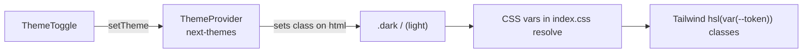

# 11 — Styling, Theming & Design System

## Approach

Styling is **utility-first Tailwind CSS** with a small set of design tokens
expressed as **CSS variables**, plus the **shadcn/ui** pattern: headless Radix
primitives wrapped in lightly-styled components that live in the repo
(`src/components/ui/*`). There are no CSS modules or styled-components.

## Design tokens (`src/index.css`)

Colors are defined as HSL channel triples in CSS variables, once for `:root`
(light) and once for `.dark`. Tailwind maps each to a color name in
`tailwind.config.js` (e.g. `hsl(var(--primary))`).

| Token | Light | Dark | Meaning |
| ----- | ----- | ---- | ------- |
| `--background` / `--foreground` | warm off-white / near-black | dark grey / near-white | page base |
| `--card` / `--card-foreground` | white | `240 5% 18%` | card surfaces |
| `--popover` | light grey | `240 5% 24%` | popovers/menus |
| `--primary` | indigo `244 75% 59%` | indigo `244 80% 67%` | brand/accent |
| `--secondary`, `--muted`, `--accent` | greys | greys | subdued surfaces/text |
| `--destructive` | red | red | errors/danger |
| `--success` | green `142 71% 45%` | green | healthy/best states |
| `--border` / `--input` / `--ring` | light grey | dark grey | borders & focus ring |
| `--radius` | `0.65rem` | — | base border radius |

`borderRadius` in Tailwind derives `lg/md/sm` from `--radius`. Switching themes
is just toggling the `.dark` class on `<html>` (handled by `next-themes`).

### Global base styles

`index.css` also sets:
- A universal `border-border` default, smooth scroll, antialiasing, and font
  feature settings (`rlig`, `calt` ligatures).
- A subtle **dotted radial background texture** via `body::before` (masked so it
  fades toward the bottom).
- A `.scrollbar-thin` utility for theme-aware thin scrollbars (used by token
  viewers and the JSON panel).

## Tailwind configuration (`tailwind.config.js`)

- **`darkMode: ["class"]`** — dark mode driven by the `.dark` class.
- **`content`** globs scan `index.html` + all `src/**/*.{ts,tsx}` for class
  usage.
- **`fontFamily.mono`** — a robust monospace stack used for tokens, IDs, and
  code samples.
- **Color map** — wires every CSS variable to a Tailwind color (including the
  custom `success` color).
- **Keyframes & animations:**
  - `fade-in` (opacity + 4px rise) → `animate-fade-in`
  - `scale-in` (opacity + slight scale) → `animate-scale-in`
  - `accordion-down/up` (for collapsible content)
- **Plugin:** `tailwindcss-animate` (provides `animate-in`, `fade-in-0`,
  `zoom-in-95`, etc., used by the hover tooltip).

## Component variants (cva)

`class-variance-authority` defines type-safe variant maps:

- **`Button`** (`ui/button.tsx`): variants `default | destructive | outline |
  secondary | ghost | link`; sizes `default | sm | lg | icon`. Includes an
  `asChild` prop (via Radix `Slot`) so a button can render as an `<a>` while
  keeping styles (used for the GitHub/Medium header links).
- **`Badge`** (`ui/badge.tsx`): variants `default | secondary | outline |
  success | warning | destructive | muted`. Used for encoding tags, the "Best"
  flag, status, token counts, etc.

The `cn()` helper (`lib/utils.ts`) merges variant classes with caller overrides
and resolves Tailwind conflicts via `tailwind-merge`.

## Theming flow

- `ThemeProvider` config: `attribute="class"`, `defaultTheme="dark"`,
  `enableSystem` (follows OS preference), `disableTransitionOnChange` (prevents a
  color flash when switching).
- `index.html` ships `<html class="dark">` so the first paint is dark, avoiding a
  light flash before hydration.
- `ThemeToggle` renders a sun/moon crossfade and gates the resolved icon behind a
  `mounted` flag to avoid a hydration mismatch (`ThemeToggle.tsx:15`).

## Token coloring (`src/lib/token-colors.ts`)

A fixed 10-color pastel palette, each entry carrying both light (`bg`/`fg`) and
dark (`darkBg`/`darkFg`) values. `getTokenColor(index)` cycles the palette by
index, so coloring is **deterministic and stable** across re-renders. Components
apply it through CSS custom properties so the dark variant kicks in via a
`dark:` selector without recomputation.

## Responsiveness

- Mobile-first; the header swaps a square logo for the full banner at `sm`,
  collapses labels, and tightens spacing.
- The stats grid scales `grid-cols-2 → sm:grid-cols-3 → xl:grid-cols-6`.
- `CompareResults` hides the Tokenizer column on mobile and shows it inline under
  the model name instead.
- Token/ID viewers and the JSON panel cap their height and scroll internally
  (`scrollbar-thin`).

## Accessibility notes

- Selectors use `role="combobox"` + `aria-expanded` + `aria-label`.
- The token viewer toggle uses `role="tablist"`/`role="tab"`/`aria-selected`.
- Token blocks/chips are keyboard-operable (`tabIndex`, Enter/Space to copy) with
  visible focus rings (`focus-visible:ring`).
- `useAnimatedNumber` respects `prefers-reduced-motion` and snaps instantly when
  reduced motion is requested (`useAnimatedNumber.ts:21`).
- Icon-only buttons carry `aria-label`s; decorative SVGs use `aria-hidden`.
