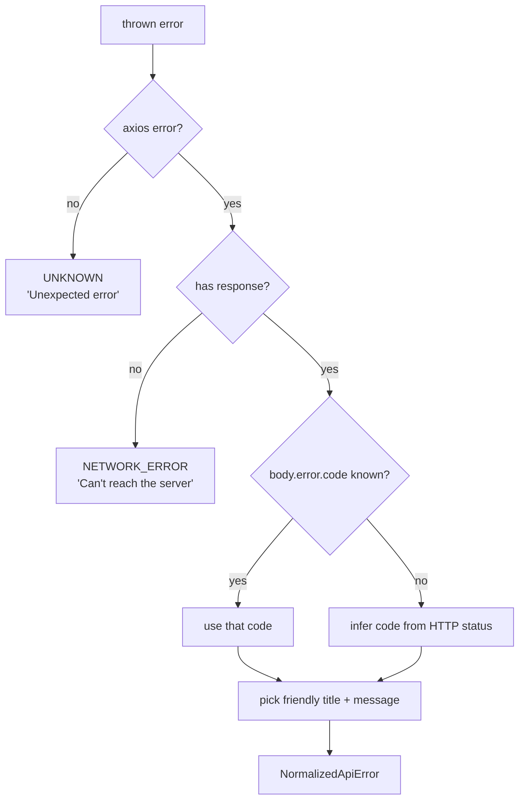

# 12 — Error Handling & Logging

The app's error philosophy: **never crash, always explain.** Every failure path
either degrades to an empty/placeholder state or surfaces a friendly toast.

## The normalization layer (`src/api/client.ts`)

All errors funnel through `normalizeApiError(error)`, which converts any thrown
value into a predictable `NormalizedApiError` `{ code, status?, title, message }`.

Resolution rules:
1. **Not an Axios error** → `UNKNOWN`.
2. **No response object** (timeout, DNS, server down, CORS block) →
   `NETWORK_ERROR`.
3. **Has a response** → prefer the backend's `error.code` if it's one of the
   known codes; otherwise map the **HTTP status** to a code (`codeFromStatus`):
   `404→MODEL_NOT_SUPPORTED`, `422→VALIDATION_ERROR`, `503→TOKENIZER_NOT_AVAILABLE`,
   `500→INTERNAL_ERROR`, else `UNKNOWN`.
4. The displayed **message** is the backend's `error.message` if present, else
   the canned copy for that code (`ERROR_COPY`).

### User-facing copy (`ERROR_COPY`)

| Code | Title | Message |
| ---- | ----- | ------- |
| `MODEL_NOT_SUPPORTED` | Model not supported | "This model isn't available for tokenization. Try another one." |
| `VALIDATION_ERROR` | Invalid request | "Please check your input and try again." |
| `TOKENIZER_NOT_AVAILABLE` | Tokenizer unavailable | "The tokenizer service is temporarily unavailable. Please retry shortly." |
| `INTERNAL_ERROR` | Something went wrong | "The server hit an unexpected error. Please try again." |
| `NETWORK_ERROR` | Can't reach the server | "No response from the tokenizer API. Make sure it's running on the configured URL." |
| `UNKNOWN` | Unexpected error | "An unexpected error occurred. Please try again." |

## Where errors are surfaced

| Surface | Mechanism | File |
| ------- | --------- | ---- |
| Tokenize failure | `toast.error(title, message)` in mutation `onError` | `useTokenize.ts:24` |
| Compare request failure (either mode) | same | `useCompare.ts:26`, `useComparePrompts.ts` |
| Per-item compare failure (model or prompt) | inline "Failed" cell/indicator + `title` tooltip with the error string | `CompareResults.tsx`, `ComparePromptsResults.tsx` |
| Models load failure | inline error box + **Retry** button | `ModelSelector.tsx:40`, `MultiModelSelector.tsx:66` |
| Health unreachable | red status dot + "API may be offline" hint | `HealthWidget.tsx:79` |
| Copy failure | `toast.error("Couldn't copy …")` | `TokenBlocks.tsx`, `copy-button.tsx` |

Toasts are rendered by the single `<Toaster />` (sonner) mounted in `main.tsx`.

## Retry strategy

- **Queries** retry **once** (`retry: 1`) by default and in `useModels`/
  `useHealth`.
- **Mutations** do not auto-retry — the user retries by clicking the action
  again.
- Manual retry affordances exist for the model load (the **Retry** button).

## Defensive rendering patterns

These prevent crashes when data is missing or oddly shaped:

- **Mostly-optional types** — almost every field in `types/index.ts` is optional
  or nullable, by design.
- **Null-coalescing fallbacks everywhere** — `data?.tokens ?? []`,
  `raw.label?.trim() || raw.id`, `model.family?.trim() || "Other"`,
  `data?.cost_currency ?? "USD"`.
- **Empty/placeholder states** — `TokenViewer` shows hints when there's no data;
  `ContextUsageCard` shows "No context window"; `CompareResults` shows an empty
  prompt card.
- **Format guards** — `formatNumber`/`formatCost`/`formatMb` return `—` (or
  "Pricing unavailable") for `null`/`undefined`/`NaN`.
- **Try/catch around risky ops** — `JSON.stringify` in `JsonViewer`, the
  currency formatter (unknown currency code falls back), and `copyToClipboard`.
- **Shape tolerance** — `getModels` accepts either `{ items: [...] }` or a bare
  array.

## Logging

There is **no application logging framework** and no analytics/telemetry. By
design:

- `prewarm()` deliberately **swallows all errors** (`.catch(() => {})`) — it's
  best-effort and must never throw (`endpoints.ts:25`).
- The only "log surface" is user-facing toasts and inline UI states.
- Network requests are observable via the browser DevTools Network tab; failed
  requests there are the primary debugging signal (see
  [Troubleshooting](./17-troubleshooting.md)).

If centralized logging/error reporting is needed later, the natural insertion
points are the mutation `onError` handlers and `normalizeApiError`.
