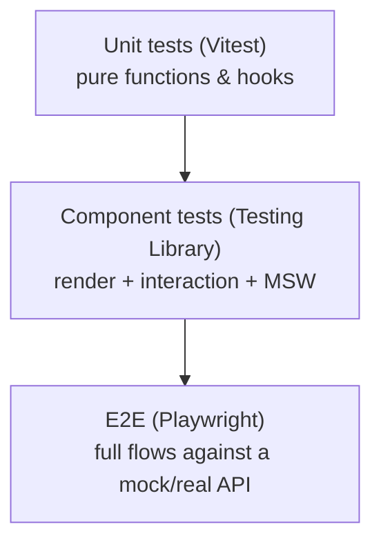

# 14 — Testing Strategy & Coverage

## Current state

There is **no automated test suite** in the repository today: no test runner is
configured, no test files exist, and `package.json` has no `test` script. The
quality gates that *do* exist are:

- **TypeScript** (`tsc -b` in the build) — strict mode with `noUnusedLocals`,
  `noUnusedParameters`, and `noFallthroughCasesInSwitch`. This catches a large
  class of errors at build time and **fails the build** on violation.
- **`npm run lint`** — wired to `eslint .` (note the ESLint config caveat in
  [Tech Stack](./03-tech-stack.md)).

This section therefore documents both a **manual test plan** you can use today
and a **recommended automated strategy** for when tests are added.

## Manual test plan

Run `npm run dev` with the API reachable, then verify:

### Tokenizer page
1. **Model loads & auto-selects** — dropdown populates; `gpt-5` (or first
   non-deprecated) is preselected.
2. **Search** — typing filters by name, id, and family.
3. **Tokenize** — paste text, click Tokenize (and try ⌘/Ctrl+Enter). Stats
   populate and animate; token blocks render with colors and preserved
   whitespace.
4. **Tokens ↔ IDs toggle** — switches views; disabled tab when its data is
   absent.
5. **Hover/copy** — hovering a token shows the tooltip; clicking copies it
   (toast appears).
6. **Insight tables** — expensive-words and frequent-tokens tables appear and
   match the input.
7. **Context usage** — bar reflects `token_count / context_window`; color
   shifts at 70% / 90%.
8. **Cost = null** — when the API returns `estimated_input_cost: null`, the card
   reads "Pricing unavailable".
9. **Clear** — empties input and snaps stats to zero (no count-down animation).
10. **Large input** — paste >5000 tokens; the "Show all" cap appears.

### Compare page
11. **< 2 models** — Compare shows the "pick at least two" toast.
12. **Ranked results** — successful rows sort ascending, "Best" flagged, "+X%"
    shown; a bad model id sinks to the bottom as "Failed".
13. **State persistence** — navigate Tokenize ↔ Compare; selected models + text
    persist.

### Cross-cutting
14. **Theme** — toggle light/dark; no flash; preference persists on reload.
15. **Offline API** — stop the API; health dot turns red, tokenize shows the
    "Can't reach the server" toast, model load shows Retry.
16. **Reduced motion** — with OS reduced-motion on, numbers snap instead of
    animating.
17. **Responsive** — check mobile widths (logo swap, stats grid, compare column
    hiding).

## Recommended automated strategy

### 1. Unit tests — highest value, lowest effort
The pure logic functions are the best ROI and have zero React/DOM dependencies:

| Target | File | What to assert |
| ------ | ---- | -------------- |
| `normalizeApiError` | `api/client.ts` | status→code mapping, body-code precedence, network case |
| `normalizeModel` | `api/endpoints.ts` | field mapping, deprecated derivation, fallbacks |
| `groupModelsByFamily` | `hooks/useModels.ts` | grouping + first-appearance ordering |
| `computeExpensiveWords` / `computeFrequentTokens` | `components/TokenTables` | counts, top-N, tie-breaking, multi-token words |
| `formatNumber/Cost/Mb`, `countWords` | `lib/utils.ts` | precision, null/NaN → `—`, currency fallback |
| `getTokenColor` | `lib/token-colors.ts` | deterministic cycling |
| `isHealthy` / `readMemory` | `hooks/useHealth.ts` | status synonyms, memory extraction |

Suggested tooling: **Vitest** (integrates natively with Vite) +
**@testing-library/react** for hooks/components, **MSW** to mock the API.

### 2. Component tests
Render `ModelSelector`, `PromptInput`, `TokenViewer`, `CompareResults`,
`StatsCards` with mocked React Query data and assert loading/empty/error/success
states and key interactions (submit shortcut, copy, toggle, retry).

### 3. End-to-end
A couple of Playwright flows (tokenize happy path; compare with a partial
failure) running against MSW or a disposable API instance.

### Coverage priorities
Focus coverage on the **logic layer** (`lib/`, `api/`, `hooks/`, the
`TokenTables` algorithms) — that's where correctness bugs hide. UI primitives in
`components/ui/*` are vendored shadcn/ui and need little testing.
