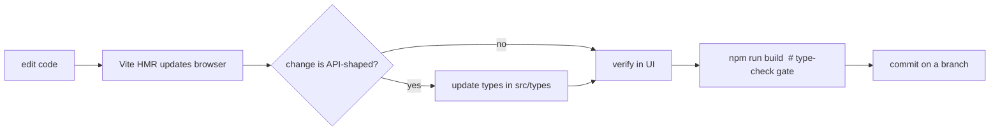

# 15 — Development Workflow & Coding Standards

## Prerequisites

- **Node.js** ≥ 18 (Vite 6 requires a modern Node; `@types/node` is v22).
- **npm** (the repo ships `package-lock.json`).
- A running **PromptTokenizer API** (locally on port 8000 for the default dev
  proxy, or any origin via `VITE_API_BASE_URL`).

## First-time setup

```bash
git clone <repo-url>
cd PromptTokenizerUI
npm install
cp .env.example .env       # optional; leave VITE_API_BASE_URL empty to use the dev proxy
npm run dev                # http://localhost:5173
```

If you don't have the API locally, set `VITE_API_BASE_URL` in `.env` to a
deployed API origin instead.

## Everyday loop



- **`npm run dev`** — hot-reloading dev server.
- **`npm run build`** — run before committing significant changes; `tsc -b`
  is the real correctness gate and will fail on type errors.
- **`npm run preview`** — sanity-check the production bundle.
- **`npm run lint`** — see the ESLint caveat below.

## Branching, commits & PRs

The git history uses **Conventional Commits**. Match the existing style:

```
feat: add token comparison page
fix: prevent header banner from stretching on mobile
style: make header layout responsive on mobile
perf: pre-warm Render free-tier backend on page load
```

Prefixes seen in history: `feat`, `fix`, `style`, `perf`. Use a short
imperative summary. Work on a branch and open a PR against `main`; do not commit
directly to `main` unless you own the repo and it's trivial.

## Coding standards & conventions

These are **observed conventions** in the codebase — follow them so new code
reads like the old code.

### TypeScript
- **Strict mode is on.** No `any` escapes; prefer precise types and
  null-coalescing (`??`) / optional chaining (`?.`).
- **Shared API types live in `src/types/index.ts`**; component-local prop
  interfaces stay in the component file, named `<Component>Props`.
- Use `import type { … }` for type-only imports (the codebase does this
  consistently).
- Keep API-facing fields **optional/defensive** to tolerate payload drift.

### React
- **Function components only**, with hooks. No class components.
- One feature per folder: `components/<Feature>/<Feature>.tsx`; co-locate
  sub-components.
- **Data access goes through a hook**, never Axios directly in a component.
- Memoize derived/expensive computation with `useMemo` (e.g. grouping, table
  analytics, compare rows).
- Prefer controlled inputs and lifting state only as far as needed (Compare
  state is the deliberate exception — hoisted to `<App>`).

### Imports & aliases
- Use the **`@/`** alias for all `src` imports (`@/components/...`,
  `@/hooks/...`, `@/lib/...`). Avoid long relative chains.

### Styling
- **Tailwind utility classes**; compose conditional classes with `cn()`.
- Use design-token colors (`bg-primary`, `text-muted-foreground`, `bg-success`)
  rather than raw hex, except the token palette which is intentionally fixed.
- New variants belong in the `cva` maps in `ui/button.tsx` / `ui/badge.tsx`.

### Comments
- The codebase favors **"why" comments** on non-obvious decisions (e.g. why the
  tooltip is shared, why compare state is hoisted, why prewarm runs before
  mount). Match that density — explain intent, not mechanics.

### Accessibility
- Provide `aria-label`s on icon-only controls, correct `role`s on custom
  widgets, and keyboard handlers for custom interactive elements. Respect
  `prefers-reduced-motion`.

## ESLint caveat

`npm run lint` runs `eslint .`, but there is **no ESLint config file or `eslint`
devDependency** committed. Until that's added, lint results depend on a
globally-installed ESLint. To make linting reproducible, add `eslint` +
`typescript-eslint` + a flat config (`eslint.config.js`) to the project. See
[Tech Stack](./03-tech-stack.md).

## Adding a new feature — worked patterns

**Add a new API call:**
1. Add/extend the types in `src/types/index.ts`.
2. Add a typed wrapper in `src/api/endpoints.ts`.
3. Add a React Query hook in `src/hooks/` (query or mutation; normalize errors).
4. Consume the hook in a component; render loading/empty/error/success states.

**Add a new stat card:** extend `StatsCards.tsx` (reuse `StatShell` and
`useAnimatedNumber`), and adjust the grid column count if needed.

**Add a new route:** extend the `NAV_ITEMS` in `Header.tsx`, branch on the route
in `App.tsx`, and (if the page needs persistent state) hoist it like
`useCompareSession`.

## Definition of done

- Builds clean (`npm run build` passes type-check).
- New API shapes reflected in `src/types`.
- Loading, empty, error, and success states all handled.
- Works in light + dark and at mobile width.
- Conventional-commit message; PR against `main`.
