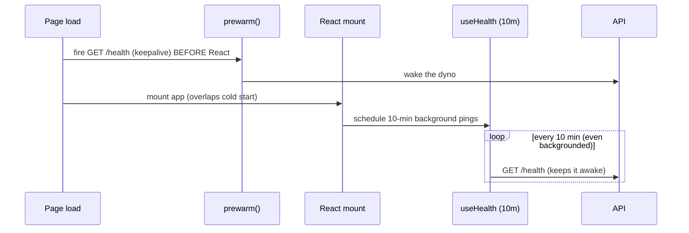

# 16 — Performance Considerations & Optimizations

The app is small and mostly I/O-bound (it waits on the API), so performance work
focuses on three things: **rendering large token lists**, **smooth animation**,
and **hiding backend cold starts**.

## 1. Rendering large token outputs

A long prompt can produce tens of thousands of tokens. Two techniques keep the
DOM responsive:

### Soft render cap
Both `TokenBlocks` and `TokenIdChips` cap initial rendering at
**`INITIAL_CAP = 5000`** items and show a "N more hidden / Show all" control
beyond that (`TokenBlocks.tsx:13`, `TokenIdChips.tsx:13`). This prevents the
browser from trying to lay out 100k DOM nodes at once. Both viewers also cap
their scroll height (`MAX_AUTO_HEIGHT = 300px`) and scroll internally.

### Single shared hover tooltip
Instead of mounting one Radix tooltip per token (which would create thousands of
listeners and portals), there is **one** floating tooltip element driven by
hover state and rendered via `createPortal` (`HoverTooltip.tsx:17`). `show()`
reads the hovered element's bounding rect and repositions the single tooltip.
This is the key optimization that makes thousands of interactive blocks viable.

### Efficient analytics
`computeExpensiveWords` uses a typed `Int32Array` char→word map and a single
linear pass over tokens rather than nested scans (`TokenTables.tsx:202`). Both
table computations are wrapped in `useMemo` keyed on `tokens`/`tokenIds`, so they
only recompute when the tokenize result changes.

> `@tanstack/react-virtual` is a dependency available for windowing if the soft
> cap ever proves insufficient; the current approach (cap + reveal) is simpler
> and adequate for typical inputs.

## 2. Animation performance

- **`useAnimatedNumber`** drives stat counters with `requestAnimationFrame` and
  an easeOutCubic curve, cancelling the previous frame loop on change
  (`useAnimatedNumber.ts`). It **respects `prefers-reduced-motion`** and snaps
  instantly when animation is disabled — also used when clearing results so
  cards reset immediately instead of counting down.
- CSS-based entrance animations (`animate-fade-in`, `animate-scale-in`) are
  GPU-friendly transforms/opacity, not layout-thrashing properties.
- The progress bar transitions via `transform: translateX` (compositor-friendly)
  rather than width (`ui/progress.tsx`).
- `disableTransitionOnChange` on the theme provider avoids a mass transition
  repaint when switching themes.

## 3. Network & backend cold-start

The API runs on a free tier that sleeps when idle. Mitigations:

- **Pre-warm before mount** overlaps spin-up with app init (`main.tsx:13`).
- **10-minute keep-warm poll** (incl. background) keeps the dyno awake while a
  tab is open (`useHealth.ts:14`).
- **30s Axios timeout** bounds worst-case waits (`client.ts:15`).

## 4. Caching

- **Models** are cached for **30 minutes** (`useModels`), shared across both
  selectors — the catalog is fetched at most once per session under normal use.
- **`refetchOnWindowFocus: false`** globally avoids redundant refetches on tab
  switches (health re-enables it intentionally).
- React Query dedupes concurrent identical requests automatically.

## 5. Bundle & asset size

- The production `dist/` is small (≈650 KB including PNG/SVG assets); the JS/CSS
  bundle alone is a fraction of that.
- Icons come from `lucide-react` as **individual component imports**, which
  tree-shake well — only used icons ship.
- shadcn/ui primitives are hand-vendored, so only the components actually used
  are included.
- Vite content-hashes assets for long-term CDN caching.

## 6. Perceived performance

- **Skeletons** during loading (model dropdown, stat cards, compare table) keep
  layout stable and signal progress.
- **Empty/placeholder states** render immediately so the page never looks
  broken before the first request.
- **Optimistic UI affordances** (instant copy feedback, animated counters) make
  the app feel snappy even while waiting on the network.

## Watch-outs / future ideas

- If users routinely paste enormous inputs, consider switching the token viewers
  from "cap + Show all" to true virtualization with `react-virtual`.
- Consider debouncing or guarding against rapid repeated tokenize submissions
  (currently gated only by the button's `isLoading`/`disabled` state).
- A CSP and explicit cache headers (via Vercel) would complement the existing
  asset hashing.
